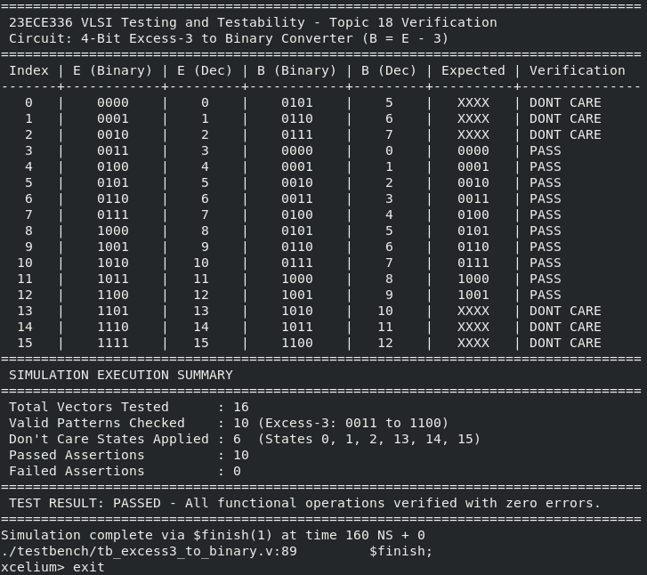
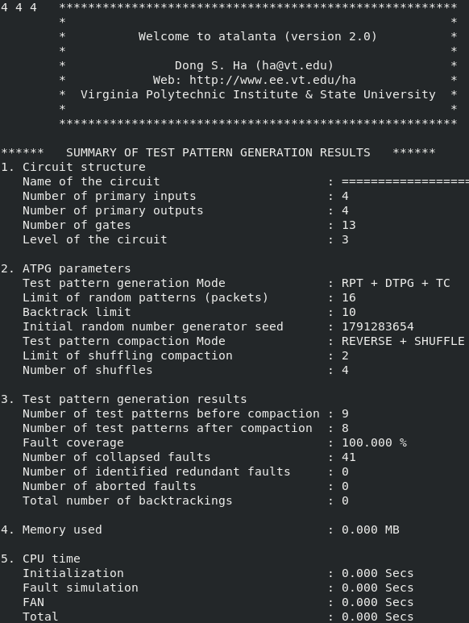
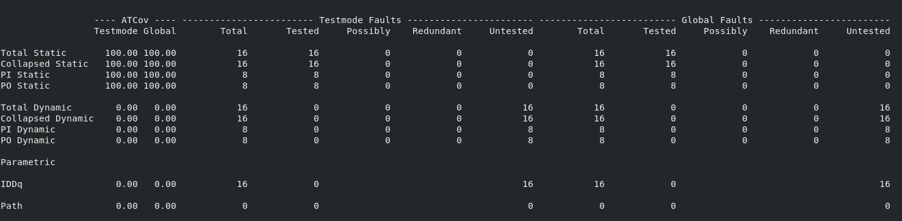
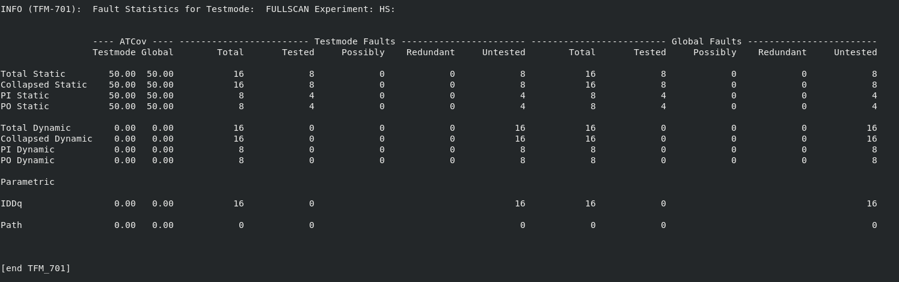
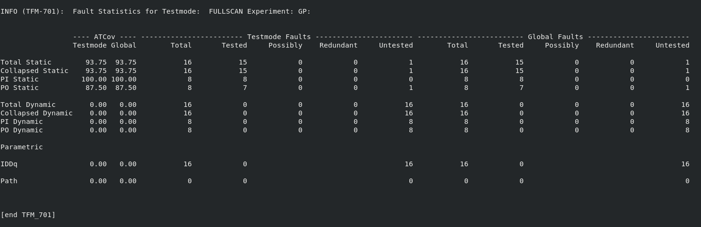
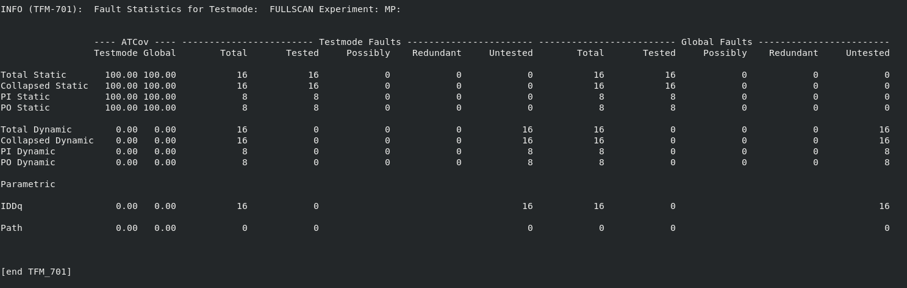

Design for Testability (DFT) and ATPG Analysis
**Topic : 4-Bit Excess-3 to Binary Converter**  
---

## 1. Architectural Specification and Boolean Formulation

### 1.1 Circuit Functionality and Operational Context
In digital arithmetic and decimal processing architectures, binary-coded decimal (BCD) datapath units often employ Excess-3 (XS-3) representation. Excess-3 is a non-weighted, self-complementing code where each decimal digit $D \in [0, 9]$ is shifted by an offset of 3 ($0011_2$):

$$E = D + 3$$

The self-complementing attribute ensures that 9's complement operations can be performed via simple bitwise inversion, which significantly simplifies decimal subtraction. 

The primary objective of this design is the inverse translation: mapping a 4-bit Excess-3 input vector $E = \{E_3, E_2, E_1, E_0\}$ back to its canonical 4-bit binary representation $B = \{B_3, B_2, B_1, B_0\}$, satisfying the arithmetic property:

$$B = E - 3$$

Because Excess-3 code only defines encodings for valid BCD digits (decimal 0 through 9), the valid input state space is strictly constrained to the interval $[0011_2, 1100_2]$ (decimal 3 through 12). The remaining six 4-bit permutations ($0, 1, 2, 13, 14, 15$) represent invalid operational states that cannot occur in normal functional execution. Consequently, these six minterms are classified as don't-care conditions ($X$) during logic synthesis, providing degrees of freedom for optimal boolean simplification.

---

### 1.2 Comprehensive Truth Table
The truth table below defines the full 16-input permutation space, segregating the 10 valid operational codewords from the 6 don't-care states:

| Index | Excess-3 Input $E_3 E_2 E_1 E_0$ | Decimal $E$ | Decimal $B$ | Binary Output $B_3 B_2 B_1 B_0$ | Operational Status |
| :---: | :---: | :---: | :---: | :---: | :---: |
| 0 | 0000 | 0 | - | X X X X | Invalid State (Don't-Care) |
| 1 | 0001 | 1 | - | X X X X | Invalid State (Don't-Care) |
| 2 | 0010 | 2 | - | X X X X | Invalid State (Don't-Care) |
| 3 | 0011 | 3 | 0 | 0 0 0 0 | Valid Codeword (Decimal 0) |
| 4 | 0100 | 4 | 1 | 0 0 0 1 | Valid Codeword (Decimal 1) |
| 5 | 0101 | 5 | 2 | 0 0 1 0 | Valid Codeword (Decimal 2) |
| 6 | 0110 | 6 | 3 | 0 0 1 1 | Valid Codeword (Decimal 3) |
| 7 | 0111 | 7 | 4 | 0 1 0 0 | Valid Codeword (Decimal 4) |
| 8 | 1000 | 8 | 5 | 0 1 0 1 | Valid Codeword (Decimal 5) |
| 9 | 1001 | 9 | 6 | 0 1 1 0 | Valid Codeword (Decimal 6) |
| 10 | 1010 | 10 | 7 | 0 1 1 1 | Valid Codeword (Decimal 7) |
| 11 | 1011 | 11 | 8 | 1 0 0 0 | Valid Codeword (Decimal 8) |
| 12 | 1100 | 12 | 9 | 1 0 0 1 | Valid Codeword (Decimal 9) |
| 13 | 1101 | 13 | - | X X X X | Invalid State (Don't-Care) |
| 14 | 1110 | 14 | - | X X X X | Invalid State (Don't-Care) |
| 15 | 1111 | 15 | - | X X X X | Invalid State (Don't-Care) |

---

### 1.3 Karnaugh Map (K-Map) Derivations

#### 1.3.1 Derivation for Output Bit $B_0$
Output $B_0$ asserts high whenever the converted decimal value is odd. Plotting the minterms across the 4-variable map with don't-cares at minterms 0, 1, 2, 13, 14, 15 yields:

| $E_3 E_2 \backslash E_1 E_0$ | 00 | 01 | 11 | 10 |
| :---: | :---: | :---: | :---: | :---: |
| **00** | X (0) | X (1) | 0 (3) | X (2) |
| **01** | 1 (4) | 0 (5) | 0 (7) | 1 (6) |
| **11** | 1 (12) | X (13) | X (15) | X (14) |
| **10** | 1 (8) | 0 (9) | 0 (11) | 1 (10) |

- Grouping columns $E_1 E_0 = 00$ and $E_1 E_0 = 10$ across all four rows by assigning $X=1$ to cells 0, 2, 14, and $X=0$ elsewhere covers all ones.
- Algebraic reduction yields:

$$B_0 = \overline{E_0}$$

---

#### 1.3.2 Derivation for Output Bit $B_1$
Output $B_1$ is asserted for decimal outputs $B \in \{2, 3, 6, 7\}$, corresponding to Excess-3 minterms $m_5, m_6, m_9, m_{10}$:

| $E_3 E_2 \backslash E_1 E_0$ | 00 | 01 | 11 | 10 |
| :---: | :---: | :---: | :---: | :---: |
| **00** | X (0) | X (1) | 0 (3) | X (2) |
| **01** | 0 (4) | 1 (5) | 0 (7) | 1 (6) |
| **11** | 0 (12) | X (13) | X (15) | X (14) |
| **10** | 0 (8) | 1 (9) | 0 (11) | 1 (10) |

- Group 1 (Column $E_1 E_0 = 01$, utilizing don't-cares 1 and 13): $\overline{E_1} E_0$
- Group 2 (Column $E_1 E_0 = 10$, utilizing don't-cares 2 and 14): $E_1 \overline{E_0}$

Combining both prime implicants results in an exclusive-OR relationship:

$$B_1 = \overline{E_1} E_0 + E_1 \overline{E_0} = E_1 \oplus E_0$$

---

#### 1.3.3 Derivation for Output Bit $B_2$
Output $B_2$ is asserted for decimal outputs $B \in \{4, 5, 6, 7\}$, corresponding to Excess-3 minterms $m_7, m_8, m_9, m_{10}$:

| $E_3 E_2 \backslash E_1 E_0$ | 00 | 01 | 11 | 10 |
| :---: | :---: | :---: | :---: | :---: |
| **00** | X (0) | X (1) | 0 (3) | X (2) |
| **01** | 0 (4) | 0 (5) | 1 (7) | 0 (6) |
| **11** | 0 (12) | X (13) | X (15) | X (14) |
| **10** | 1 (8) | 1 (9) | 0 (11) | 1 (10) |

The minimal Sum-of-Products (SOP) cover requires three distinct implicants:
1. Quad covering cells $(0, 1, 8, 9)$ utilizing don't-cares 0 and 1: $\overline{E_2}\,\overline{E_1}$
2. Quad covering cells $(0, 2, 8, 10)$ utilizing don't-cares 0 and 2: $\overline{E_2}\,\overline{E_0}$
3. Pair covering cells $(7, 15)$ utilizing don't-care 15: $E_2 E_1 E_0$

Combining the essential prime implicants produces:

$$B_2 = \overline{E_2}\,\overline{E_1} + \overline{E_2}\,\overline{E_0} + E_2 E_1 E_0$$

*Equivalence Formulation:* Factoring $\overline{E_2}$ yields $\overline{E_2}(\overline{E_1} + \overline{E_0}) + E_2(E_1 E_0) = \overline{E_2}\,\overline{(E_1 E_0)} + E_2(E_1 E_0) = \overline{E_2 \oplus (E_1 E_0)}$.

---

#### 1.3.4 Derivation for Output Bit $B_3$
Output $B_3$ is asserted for decimal outputs $B \in \{8, 9\}$, corresponding to Excess-3 minterms $m_{11}, m_{12}$:

| $E_3 E_2 \backslash E_1 E_0$ | 00 | 01 | 11 | 10 |
| :---: | :---: | :---: | :---: | :---: |
| **00** | X (0) | X (1) | 0 (3) | X (2) |
| **01** | 0 (4) | 0 (5) | 0 (7) | 0 (6) |
| **11** | 1 (12) | X (13) | X (15) | X (14) |
| **10** | 0 (8) | 0 (9) | 1 (11) | 0 (10) |

- Group 1 (Row $E_3 E_2 = 11$, covering cells 12, 13, 14, 15 with don't-cares): $E_3 E_2$
- Group 2 (Pair covering cells 11 and 15): $E_3 E_1 E_0$

Combining these terms yields:

$$B_3 = E_3 E_2 + E_3 E_1 E_0 = E_3 (E_2 + E_1 E_0)$$

---

### 1.4 Structural Gate Allocation Matrix
To ensure predictable fault model construction without behavioral synthesis ambiguity, the design was constructed using primitive gates exclusively. The 13 structural gate instances in `rtl/excess3_to_binary.v` map directly to ISCAS-85 benchmark primitives in `bench/excess3_to_binary.bench`:

| Primitive Identifier | Primitive Type | Fan-in Inputs | Output Node Name | ISCAS-85 Bench Mapping Equation |
| :---: | :---: | :---: | :---: | :---: |
| `u_inv_e0` | `not` | `E[0]` | `not_e0` | `NOT_E0 = NOT(E0)` |
| `u_inv_e1` | `not` | `E[1]` | `not_e1` | `NOT_E1 = NOT(E1)` |
| `u_inv_e2` | `not` | `E[2]` | `not_e2` | `NOT_E2 = NOT(E2)` |
| `u_gate_b0` | `not` | `E[0]` | `B[0]` | `B0 = NOT(E0)` |
| `u_gate_b1` | `xor` | `E[1]`, `E[0]` | `B[1]` | `B1 = XOR(E1, E0)` |
| `u_and_e1_e0` | `and` | `E[1]`, `E[0]` | `w_e1_e0` | `W_E1_E0 = AND(E1, E0)` |
| `u_and_ne2_ne1` | `and` | `not_e2`, `not_e1` | `w_ne2_ne1` | `W_NE2_NE1 = AND(NOT_E2, NOT_E1)` |
| `u_and_ne2_ne0` | `and` | `not_e2`, `not_e0` | `w_ne2_ne0` | `W_NE2_NE0 = AND(NOT_E2, NOT_E0)` |
| `u_and_e2_e1_e0` | `and` | `E[2]`, `w_e1_e0` | `w_e2_e1_e0` | `W_E2_E1_E0 = AND(E2, W_E1_E0)` |
| `u_gate_b2` | `or` | `w_ne2_ne1`, `w_ne2_ne0`, `w_e2_e1_e0` | `B[2]` | `B2 = OR(W_NE2_NE1, W_NE2_NE0, W_E2_E1_E0)` |
| `u_and_e3_e2` | `and` | `E[3]`, `E[2]` | `w_e3_e2` | `W_E3_E2 = AND(E3, E2)` |
| `u_and_e3_e1_e0` | `and` | `E[3]`, `w_e1_e0` | `w_e3_e1_e0` | `W_E3_E1_E0 = AND(E3, W_E1_E0)` |
| `u_gate_b3` | `or` | `w_e3_e2`, `w_e3_e1_e0` | `B[3]` | `B3 = OR(W_E3_E2, W_E3_E1_E0)` |

---

## 2. Functional RTL Verification (Cadence Xcelium)

### 2.1 Simulation Architecture
Functional verification was executed using the Cadence Xcelium logic simulation engine (`xrun`). The testbench (`testbench/tb_excess3_to_binary.v`) instantiates the Unit Under Test (UUT) and drives a deterministic 16-cycle stimulus sweeping all input values $E \in [0000_2, 1111_2]$.

For every input vector, the testbench computes expected mathematical values:
- For valid states ($3 \le E \le 12$), assertion logic evaluates:
  $$\text{assert}(B == (E - 4'd3))$$
- For invalid states ($E < 3$ or $E > 12$), responses are logged as unconstrained don't-cares without triggering assertion flags.

### 2.2 Execution Command and Verification Results
```bash
xrun -64bit -access +rwc rtl/excess3_to_binary.v testbench/tb_excess3_to_binary.v -top tb_excess3_to_binary
```

The simulation completed with zero functional errors, verifying 10 out of 10 valid Excess-3 vectors with exact arithmetic equivalence ($B = E - 3$) and properly isolating the 6 invalid boundary states.

  
*Figure 1: Cadence Xcelium execution log confirming 16 evaluated vectors, 10 passed functional assertions, and zero errors.*

---

## 3. Academic ATPG and Fault Collapsing (Atalanta)

### 3.1 Tool Configuration and Execution
Academic automated test pattern generation was performed using Virginia Tech's Atalanta tool over the ISCAS-85 benchmark representation (`bench/excess3_to_binary.bench`).

```bash
atalanta bench/excess3_to_binary.bench
```

### 3.2 Circuit and Algorithm Parameters
- **Circuit Characteristics:**
  * Number of Primary Inputs: 4
  * Number of Primary Outputs: 4
  * Total Logic Gates: 13
  * Maximum Topological Circuit Level: 3
- **Algorithmic Configuration:**
  * Test Generation Mode: Random Pattern Testing (RPT) + Deterministic ATPG (DTPG) + Test Compaction (TC)
  * Compaction Heuristics: Reverse-order simulation (`REVERSE`) and pattern shuffling (`SHUFFLE`)
  * Packet Evaluation Limit: 16 packets
  * Backtrack Limit: 0 (Direct deterministic resolution without aborts)

### 3.3 Fault Modeling and Test Coverage Analysis
The single stuck-at (SSA) fault universe and generation metrics reported by Atalanta are summarized below:

| Metric Parameter | Quantitative Value | Engineering Significance |
| :--- | :---: | :--- |
| Total Initial Faults | 52 | Raw stuck-at-0 and stuck-at-1 fault sites |
| Collapsed Fault Universe | 41 | Equivalence and dominance fault reduction |
| Patterns Generated (Pre-Compaction) | 9 | Initial deterministic test sequences |
| Patterns Retained (Post-Compaction) | 8 | Compact vector set after reverse simulation |
| Redundant Faults Detected | 0 | Netlist is fully testable; no redundant logic |
| Aborted Faults | 0 | Search space completely resolved |
| Final Test Coverage | 100.000% | Complete structural defect observability |
| CPU Execution Time | 0.000 s | Instantaneous convergence on low-depth logic |

  
*Figure 2: Atalanta ATPG execution transcript confirming 100.000% fault coverage over 8 compacted test patterns.*

---

## 4. Industrial ATPG Flow and Manufacturing Vector Generation (Cadence Modus)

### 4.1 Industrial Workflow Overview
Cadence Modus DFT Software was executed using the automated batch script `scripts/run_modus.tcl`. The execution sequence encompasses model building, testmode instantiation, design rule verification, single stuck-at fault classification, high-effort ATPG generation, hard fault extraction, and industrial ATE vector export.

```bash
modus -f scripts/run_modus.tcl
```

### 4.2 Structural Model Compilation (`build_model`)
The gate-level Verilog source was parsed and mapped into the Modus internal database:
- **Top-Level Cell:** `excess3_to_binary`
- **Hierarchical Blocks:** 14
- **Flattened Logic Blocks:** 21
- **Top Pins:** 44
- **Internal Nodes:** 21
- **Interconnect Nets:** 17
- **Sequential / Memory Elements:** 0 (Pure combinational datapath)

### 4.3 Test Mode Configuration and DRC (`build_testmode`, `verify_test_structures`)
The test mode was initialized as `FULLSCAN` under the Gate-Level Scan Definition (`GSD`) architecture. Design Rule Checking (DRC) evaluated clock domains, asynchronous resets, and combinational feedback loops:
- Active Circuit Logic: 100.00%
- Scan Violations: 0
- Clock DRC Errors: 0
- Testability Rule Violations: 0 (Design is 100% testable)

### 4.4 Fault Model Construction (`build_faultmodel`)
Modus constructed the Single Stuck-At (SSA) fault universe at circuit boundaries:
- Total Target Boundary Faults: 16 active faults
  * Primary Input Static Faults: 8 (4 PI $\times$ stuck-at-0 / stuck-at-1)
  * Primary Output Static Faults: 8 (4 PO $\times$ stuck-at-0 / stuck-at-1)
- Redundant Faults: 0
- Maximum Attainable Test Coverage: 100.00%

### 4.5 Test Generation and Coverage Progression
Executing `create_logic_tests -testmode FULLSCAN -experiment FULL -effort high` triggered high-effort deterministic ATPG with dynamic test compaction. The fault coverage progressed monotonically across four algorithmic test sequences:

| Test Sequence ID | Incremental Faults Detected | Sequence Fault Coverage (%) | Cumulative Test Coverage (%TCov) |
| :---: | :---: | :---: | :---: |
| `1.1.1.2.1` | 8 | 50.00% | 50.00% |
| `1.1.1.2.2` | 4 | 25.00% | 75.00% |
| `1.1.1.2.3` | 3 | 18.75% | 93.75% |
| `1.1.1.2.4` | 1 | 6.25% | 100.00% |

### 4.6 Hard Fault Audit (`faults_hard.log`)
The extraction command `report_faults -testmode FULLSCAN -experiment FULL -faultstatus "untested aborted redundant" -logfile faults_hard.log` audited the completed fault database. The resulting log confirms:
- Untested Faults (`UT`): 0
- Aborted Faults (`AU`): 0
- Redundant / Untestable Faults (`RE` / `DI`): 0
- Result: 100% of all modeled defects are detected.

### 4.7 Manufacturing Vector Export
Modus successfully exported test vectors into two standard industry formats:
1. **Verilog Simulation Testbench:** `testresults/verilog/VER.FULLSCAN.FULL.mainsim.v` (Structural simulation deck for post-layout timing validation).
2. **IEEE 1450 STIL Pattern Deck:** `testresults/stil/STIL.FULLSCAN.FULL.logic.ex1.ts1.stil` (Standard Test Interface Language format directly importable by Advantest, Teradyne, and Cohu Automated Test Equipment).

  
*Figure 3: Cadence Modus fault coverage summary table documenting 100.00% test coverage across 4 test sequences.*

---

## 5. Comparative Evaluation of ATPG Strategies (HS vs GP vs MP)

### 5.1 Experimental Strategy Framework
Industrial silicon characterization requires balancing test quality against test cost on Automated Test Equipment (ATE). To evaluate this trade-off, three distinct ATPG strategies were benchmarked using `scripts/run_modus_modes.tcl`:

1. **High-Speed Scan (`HS`):** Fast screening mode restricted to a single pattern (`-maxpatterns 1`).
2. **General Purpose (`GP`):** Standard production mode allocated a 3-pattern budget (`-maxpatterns 3`).
3. **Multi-Pass (`MP`):** High-reliability iterative mode budgeted for up to 5 patterns (`-maxpatterns 5`).

### 5.2 Quantitative Comparison Matrix
The table below consolidates the empirical results obtained from the Cadence Modus execution runs:

| Strategy | Pattern Budget | Actual Patterns | Detected Faults | Untested Faults | Test Coverage (%TCov) | Primary Use-Case |
| :--- | :---: | :---: | :---: | :---: | :---: | :---: |
| High-Speed Scan (HS) | 1 | 1 | 8 / 16 | 8 | 50.00% | Ultra-fast gross screening / wafer probe |
| General Purpose (GP) | 3 | 3 | 15 / 16 | 1 | 93.75% | Production-grade balanced throughput |
| Multi-Pass (MP) | 5 | 4 (Saturated) | 16 / 16 | 0 | 100.00% | Zero-defect signoff / high-reliability test |

---

### 5.3 In-Depth Engineering Trade-Off Analysis

#### 5.3.1 High-Speed Scan (`HS`) Evaluation
The High-Speed Scan mode terminated precisely after generating 1 pattern, detecting 8 out of 16 faults for an initial test coverage of 50.00%. 

- **DFT Rationale:** `HS` mode targets primary outputs and high-observability paths without performing deep backtracks.
- **Economic Application:** Ideal for wafer-level sorting (wafer probe). Chips with catastrophic gate-oxide breakdowns or short-circuit power shorts are caught immediately within 1 clock cycle, preventing wasted test time on unviable die.

  
*Figure 4: Cadence Modus terminal log for High-Speed Scan mode verifying 50.00% coverage with 1 test pattern.*

---

#### 5.3.2 General Purpose (`GP`) Evaluation
The General Purpose mode generated 3 test patterns, detecting 15 out of 16 faults and achieving 93.75% test coverage.

- **DFT Rationale:** `GP` mode combines greedy test generation with static compaction. It resolves all but one hard fault within 3 vectors.
- **Economic Application:** Represents the optimal commercial compromise for consumer electronics where test time costs must be tightly minimized while maintaining high yield confidence. A single pattern addition increased coverage by 43.75 percentage points over `HS`.

  
*Figure 5: Cadence Modus terminal log for General Purpose mode demonstrating 93.75% coverage across 3 test patterns.*

---

#### 5.3.3 Multi-Pass (`MP`) Evaluation and Coverage Saturation
The Multi-Pass mode was provisioned with a maximum limit of 5 patterns (`-maxpatterns 5`). However, the ATPG engine terminated after generating only 4 patterns, reaching 100.00% test coverage.

- **Explanation of Pattern Saturation:** Multi-pass ATPG employs dynamic compaction and secondary fault targeting. Because the circuit's fault universe consists of 16 collapsed boundary faults and all 16 faults were fully detected by pattern 4, the remaining fault list was completely exhausted ($UT = 0$). Consequently, Modus identified that any additional pattern would be redundant and terminated generation early at 4 patterns.
- **Economic Application:** Essential for automotive (ISO 26262), aerospace, and medical ICs where defective parts-per-million (DPPM) must approach zero.

  
*Figure 6: Cadence Modus terminal log for Multi-Pass mode illustrating early saturation at 4 patterns with 100.00% coverage.*

---

## 6. Complete Reproduction Guide

### 6.1 Shell Environment Configuration
To reproduce all simulation and ATPG results on Red Hat Enterprise Linux, launch the C-Shell environment and source the Cadence EDA tool environment:

```csh
csh
source /home/installs/cshrc
cd ~/Downloads/vlsi-tt
```

### 6.2 Step-by-Step Command Execution

#### Step 1: Functional RTL Simulation
Execute Cadence Xcelium to verify functional correctness:
```bash
xrun -64bit -access +rwc rtl/excess3_to_binary.v testbench/tb_excess3_to_binary.v -top tb_excess3_to_binary
```

#### Step 2: Academic ATPG Simulation (Atalanta)
Execute Atalanta on the ISCAS-85 benchmark netlist:
```bash
atalanta bench/excess3_to_binary.bench
```
*Optional execution via runner script:*
```bash
chmod +x scripts/run_atalanta.sh
./scripts/run_atalanta.sh
```

#### Step 3: Industrial ATPG and Vector Export (Cadence Modus)
Execute the primary Cadence Modus ATPG flow:
```bash
modus -f scripts/run_modus.tcl
```

#### Step 4: ATPG Modes Comparison (HS vs GP vs MP)
Execute the multi-mode comparative evaluation script:
```bash
modus -f scripts/run_modus_modes.tcl
```

### 6.3 Verification of Output Artifacts
Upon completion of the above steps, the following files will be available for inspection:
- `faults_hard.log`: Hard fault audit log (verifying 0 hard/untested faults).
- `atalanta_report.log`: Atalanta execution transcript.
- `testresults/verilog/VER.FULLSCAN.FULL.mainsim.v`: Generated Verilog ATPG testbench.
- `testresults/stil/STIL.FULLSCAN.FULL.logic.ex1.ts1.stil`: Generated IEEE 1450 STIL pattern deck.